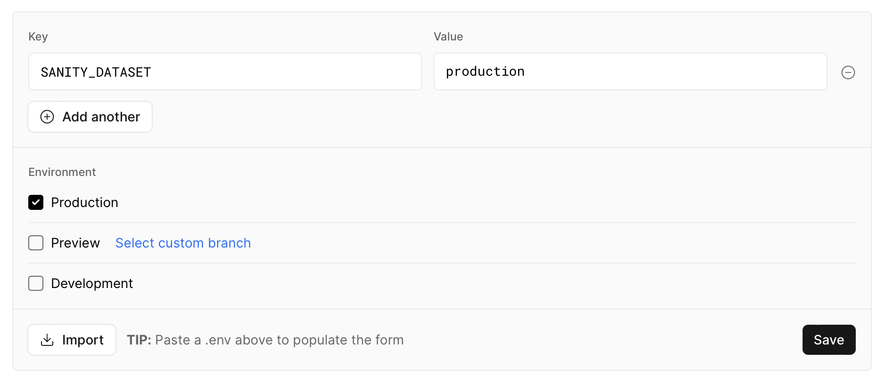
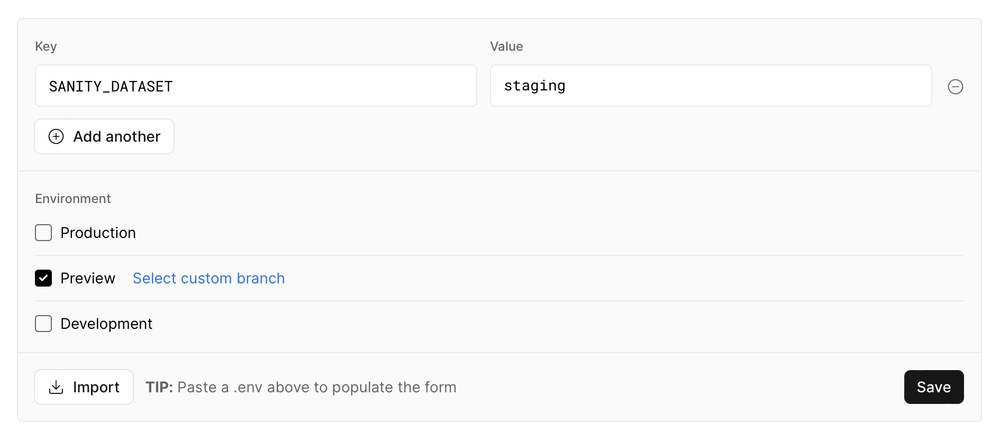

# Objective

## Get Sanity project working with production and staging environments on Vercel:

It turns out this is pretty easy with [this Sanity/Remix template](https://github.com/SimeonGriggs/sanity-remix-template) because of how the [dataset](https://www.sanity.io/docs/datasets) is being referenced in [_~/app/sanity/projectDetails.ts_](https://github.com/jamestrenda/sanity-with-staging-env/blob/main/app/sanity/projectDetails.ts), and it does not require setting up multiple [workspaces](https://www.sanity.io/docs/workspaces).

To setup a staging environment with Sanity:

1. Go [sanity.io/manage](https://sanity.io/manage) and create a new dataset ("staging"). There should already be a "production" dataset if you've [setup a project](https://www.sanity.io/docs/init) already. So now we have two datasets ("staging" and "production").
2. Go to your project's settings in Vercel and create two separate environment variables with the same name (SANITY_DATASET is what we're using for this project).

   Set one to "production" and the other to "staging", making sure that the env var for "production" is for the "production" environment only and the one for "staging" is for the "preview" environment only.

   ***

   
   

3. Create a new branch ("staging", "feature/super-cool-feature").
4. Commit a change to the schema (or anything else for that matter) and then push the changes to the newly created feature branch.
   This will trigger a "preview deployment" on Vercel using the new branch as well as the preview env var (SANITY_DATASET=staging).
5. In order to access the studio at the new preview URL, we'll need to add the preview URL to Sanity under the CORS tab.

   In the real world, we will have our own domain for production and subdomain for staging. Fortunately, Vercel gives us this for free, called "branch" URLs. This means we don't have to keep adding new URLs to our CORS settings in Sanity everytime we push a commit to our feature or staging branch because Branch URLs mirror the latest "deployment URL". If you don't know, with Vercel, you get a unique "deployment" URL for every push to a branch, but, in most cases, we'll just be interested in the main branch URL.

6. Vercel (for now) appears to follow a specific pattern with branch (or preview) URLs, so that means we should be able to set our CORS in Sanity using a "wildcard" (\*) selector. The branch URL patterns goes like this:

   [GITHUB_REPO_NAME]-git-[BRANCH_NAME]-[VERCEL_ACCOUNT_USERNAME].vercel.app

   GITHUB_REPO_NAME might actually be the Vercel project name, but typically those are the same (at least in my own experience). You can probably name the project on Vercel to whatever you want and then that will (I assume) be the value that replaces GITHUB_REPO_NAME.

   So, in the case of this project, it would be:

   **_sanity-with-staging-env-git-\*-jamestrenda.vercel.app_**

   This is the URL we add to our CORS settings in Sanity.

   I guess if we ever needed to go back in time to a specific commit, we would need to add that deployment URL to our CORS settings in Sanity, but that **_should_** be a rare occurance.

And there you have it. Two separate environments with Sanity and Remix. :partying_face:

**IMPORTANT: Due to Sanity's real-time nature, if you don't want to affect the production dataset while doing local development, you must set the SANITY_DATASET environment variable to "staging". In fact, with our fancy new multi-environment setup, it's probably never wise to use the production dataset during local development.**

## Use GitHub Actions as a CI/CD pipeline

### Copy Production to Staging

For copying the production dataset to the staging dataset, see [.github/workflows/copy-prod-dataset-to-staging.yml](https://github.com/jamestrenda/sanity-with-staging-env/blob/main/.github/workflows/copy-prod-dataset-to-staging.yml)

### Perform production backups.

For creating automatic backups with cache, see [.github/workflows/backup-routine.yml](https://github.com/jamestrenda/sanity-with-staging-env/blob/main/.github/workflows/backup-routine.yml)
